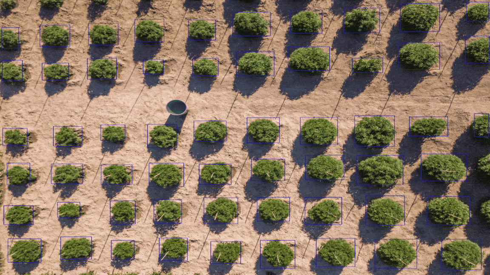
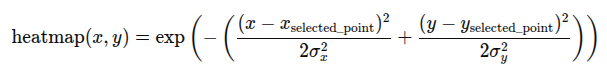
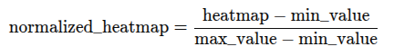

<h1>🔍 Overview</h1>

This repository generates smooth attention heatmaps from object detection results.
    It supports:
    <ul>
        <li>Input images and COCO-format bounding boxes</li>
        <li>Gaussian-based heatmap generation per object</li>
        <li>Central region focus via area_ratio</li>
        <li>Simple inference pipeline via JSON config</li>
    </ul>

<h1>Generate Heatmap</h1>

In some applications, such as visual analytics for marketing, it is valuable to visualize object presence or attention focus via a heatmap. This algorithm creates a smooth heatmap over each detected object based on its bounding box (bbox).

<h2>⚙️ Algorithm Steps:</h2>

<ol>
    <li><h3>Input:</h3></li>
    <ul>
        <li>An image (as a NumPy array)</li>
        <li>A list of bboxes, each in format <code>[x, y, width, height]</code></li>
    </ul>
    <li><h3>Generate heatmap for each bbox:</h3></li>
    <ol>
            <li><h4 id="extract_central_region">Extract the cetral region per bbox</h4>
             
We extract a central region for each bbox based on an area_ratio, according to the following steps:

                <ol>
                    <li>Compute the center of the bbox <code>(center_x, center_y)</code></li>
                    <li>Calculate the area of the bbox:</li>
                    

                    <i><b>central_region_area</b></i> = <i><b>area</b></i> × <i><b>area_ratio</b></i>
                    

                    <li>Calculate the side length of the square:</li>
                    

                    <i><b>central_region_side</b></i> = &radic;<i><b>central_region_area</b></i>
                    

                    <li>Define a square region centered at (center_x, center_y) with side length side_length</li>
                </ol>
                
<b>The result after first step:</b>

                

                
                

             </li>
             <li><h4>Select a random point inside the central region</h4>
             
Randomly selected a pixel coordinate inside the central region.

            
<b>The result after second step:</b>

             

             
             

             </li>
             <li><h4 id="generate_gaussian_heatmap">Generate Gaussian Heatmap</h4>
             
We generate a smooth 2D Gaussian heatmap centered on the selected pixel inside the bbox. This heatmap visually highlights the object with intensity fading outwards. To adapt to different object sizes and add slight randomness, we scale the Gaussian standard deviations (<code>sigma_x</code>, <code>sigma_y</code>) by a factor randomly sampled around the provided <code>sigma_ratio</code> (±0.1).

             
<b>The heatmap generation follows these steps:</b>

             <ol>
                <li>Sample a scaling factor <code>alpha</code> uniformly between <code>sigma_ratio - 0.1</code> and <code>sigma_ratio + 0.1</code>.</li>
                <li>Compute <code>sigma_x = alpha × bbox_width</code> and <code>sigma_y = alpha × bbox_height</code>.</li>
                <li>
                    For every pixel coordinate <code>(x, y)</code> on the <b>bbox</b> grid, calculate the heatmap value using the Gaussian formula:  
                    

                    
                    

                </li>
            </ol>
            
<b>Note</b> : Some bboxes may overlap in the image. When this happens, the corresponding heatmaps will also overlap. To accurately represent the combined intensity, we take the maximum value between overlapping heatmaps at each pixel, rather than summing them. This prevents artificially inflated values in the heatmap visualization.

            </li>
            <li><h4>Normalize heatmap values</h4>
            
To scale the heatmap values to a consistent range for visualization and comparison, we apply min-max normalization. This rescales all heatmap values to the range <code>[0,1]</code> by subtracting the minimum value and dividing by the range:

            

            
            

            
<b>The result after fourth step:</b>

            

            
            

            </li>
    </ol>
            <li><h3>Visualization</h3>
The final result will be as follows:

            

            
            

            </li>
</ol>

<h2>📥 Installation</h2>

<h3>1. Clone the Repository</h3>
<pre><code>git clone https://github.com/saiwa-ai/rgb2heatmap.git
cd rgb2heatmap</code></pre>

<h3>2. Create Virtual Environment (Recommended)</h3>
<pre><code>sudo apt update
sudo apt install python3-venv
python3 -m venv rgb2heatmap-env
source rgb2heatmap-env/bin/activate</code></pre>

<h3>3. Install Dependencies</h3>
  <pre><code>pip install -r requirements.txt
</code></pre>

<h2>🚀 How to Run Inference</h2>

You can configure and run the inference process using a JSON configuration by running this command:

<pre><code>python run_app.py  configs/config.json</code></pre>

<strong>Example config.json</strong>

<pre><code>{
  "input_annotation_path": "/path/to/input-annotation.json",
  "image_path": "/path/to/image",
  "output_dir": "/path/to/output/",
  "area_ratio": 0.2,
  "sigma_ratio": 0.3
}</code></pre>

<h2>📄 Parameter Description</h2>

<strong>🔔 Notes:</strong>

<ol>
  <li><code>input_annotation_path</code><strong>must</strong> follow the <strong>COCO format</strong>.</li>
  <li>If your annotations are in the <a href="https://saiwa.ai/fraime/">Fraime</a> platform format, you can convert them to COCO using the
    <code>convert_fraime_to_coco.py</code> script located in the <code>utils/</code> directory.
  </li>
</ol>

<table border="1" cellpadding="6" cellspacing="0">
  <thead>
    <tr>
      <th>Key</th>
      <th>Type</th>
      <th>Description</th>
    </tr>
  </thead>
  <tbody>
    <tr>
      <td><code>input_annotation_path</code></td>
      <td>str</td>
      <td>Path to the COCO-formatted annotation file corresponding to the input image.</td>
    </tr>
    <tr>
      <td><code>image_path</code></td>
      <td>str</td>
      <td>Path to the image on which you want to run inference.</td>
    </tr>
    <tr>
      <td><code>output_dir</code></td>
      <td>str</td>
      <td>Directory where the output (the image) will be saved</td>
    </tr>
    <tr>
      <td><code>area_ratio</code></td>
      <td>float</td>
      <td>
        This parameter defines the relative area used when extracting the central region of each bounding box. 
        For more information, please refer to <a href="#extract_central_region">Extract Central Region</a>.
      </td>
    </tr>
    <tr>
      <td><code>sigma_ratio</code></td>
      <td>float</td>
      <td>
        This parameter controls the spread of the Gaussian kernel during heatmap generation. 
        For more information, please refer to <a href="#generate_gaussian_heatmap">Generate Gaussian Heatmap</a>.
      </td>
    </tr>
  </tbody>
</table>

